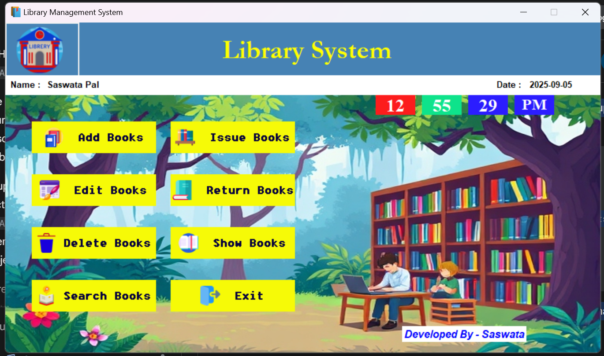

# 📚 **Library Management System (Tkinter + SQLite3)**

## 🧩 **Overview**
The **Library Management System** is a Python-based desktop application built using **Tkinter** for the graphical user interface (GUI).  
It helps users manage **book records**, track **issued and returned books**, maintain **student data**, and automate **date-based operations** efficiently — all through a clean and interactive interface.

This project combines the power of **Tkinter**, **SQLite3**, and **Pillow** to deliver a fully functional and user-friendly experience.

---

## 🚀 **Features**
- ✅ *Add, Update, and Delete* Books and Students  
- ✅ *Issue and Return Books* with date tracking  
- ✅ *Automatic Fine Calculation* using `datetime` and `timedelta`  
- ✅ *Calendar Widget* for smooth date selection (`tkcalendar`)  
- ✅ *Search, Filter, and Sort* records with `ttk.Treeview`  
- ✅ *Beautiful UI* with icons and images (`Pillow`, `PhotoImage`)  
- ✅ *Local Database Storage* using `SQLite3`  
- ✅ *Smart Alerts* and validations using `messagebox`

---

## 🖼️ **Tech Stack**

| Category | Library / Module | Description |
|-----------|------------------|-------------|
| **GUI Framework** | `tkinter` | Used to create the graphical user interface. |
| **Modern Widgets** | `ttk` | Themed widgets (Treeview, Combobox) for a polished UI. |
| **Pop-ups** | `messagebox` | Displays alerts and confirmations. |
| **Calendar Widget** | `tkcalendar` | Adds a date picker to the app. |
| **Database** | `sqlite3` | Lightweight, serverless database. |
| **Date & Time** | `datetime`, `timedelta`, `time` | Used for issue/return date management. |
| **Image Handling** | `Pillow (PIL)` | Loads and resizes images in the GUI. |
| **Icons** | `PhotoImage` | Displays icons and small images in widgets. |

---

## 🛠️ **Installation and Setup**

### 1️⃣ **Clone the Repository**
```bash
git clone https://github.com/Saswata-pal/library-management-system.git
cd library-management-system 
```

### 2️⃣ **Install Dependencies

Make sure you have Python 3.x installed, then run:
```bash
pip install tkcalendar Pillow
```

(tkinter and sqlite3 come pre-installed with Python.)

### ▶️ **How to Run
```bash
python main.py
```

This will launch the main application window of the Library Management System.

### 🗄️ Database Information

##### **The application uses a local SQLite database (library.db) to store:

📖 Book details: Title, Author, Publication, Availability
👨‍🎓 Student details: Name, Roll No, Class, Contact
🧾 Issue details: Book issued to which student, with issue and return dates

All records persist even after the app is closed.

### 📆 Example Use Case

Add a new book or student into the system.
Select a book and issue it to a student using the calendar widget.
Return the book and automatically calculate fines if late.
View all records in the Treeview table with search and filter options.

## 🖼️ **Demo Screenshots**

### 🖼️ **Demo Screenshots**

### 🖼️ **Demo Screenshots**

<div align="center">
  
  
</div>

<div align="center">
  
  
</div>


### 💡 **Future Enhancements

📤 Generate PDF reports for all transactions
☁️ Connect to a cloud-based database
🔒 Add admin authentication and role-based access
🔔 Send due-date reminders via email or SMS


### 👨‍💻 Author
Saswata pal
💼 GitHub: @Saswata-pal
